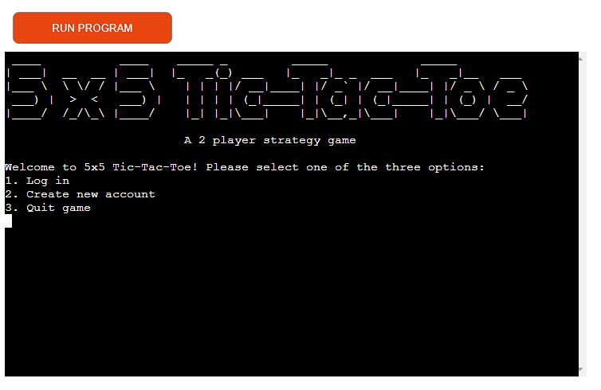
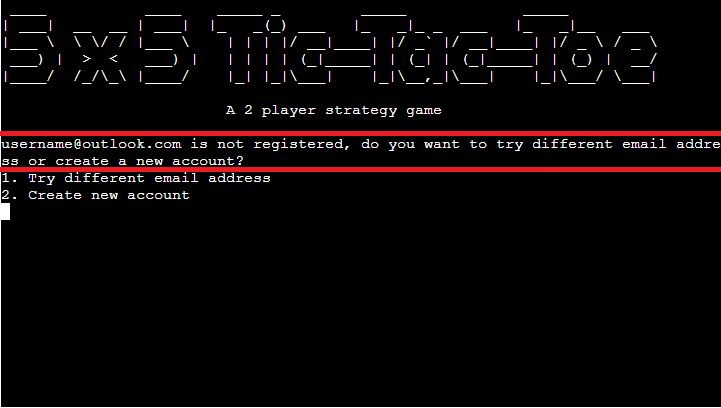
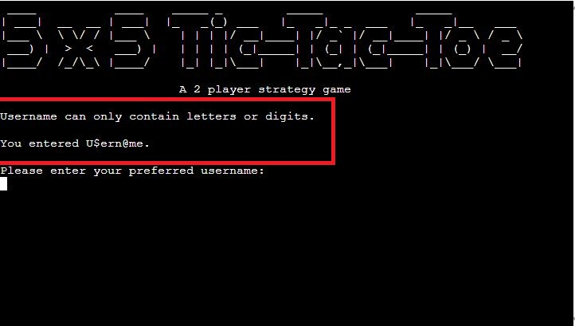
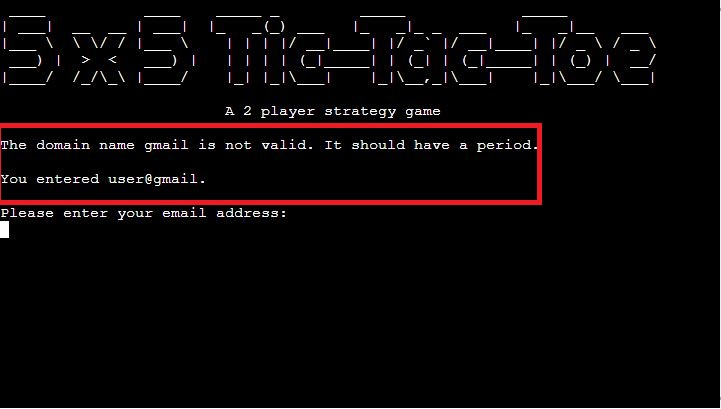
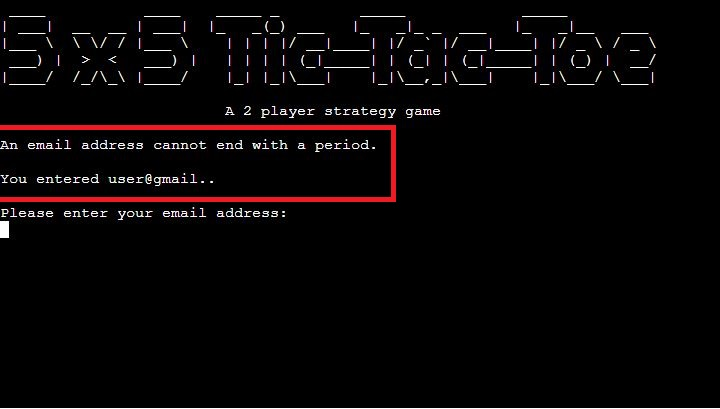
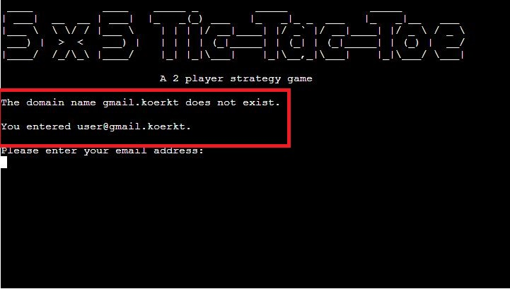
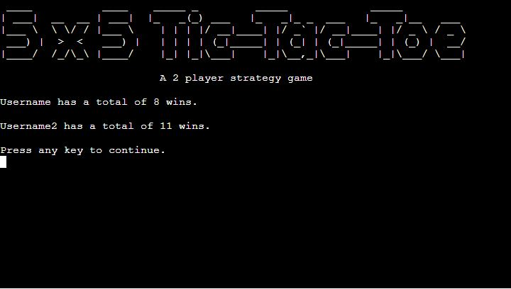
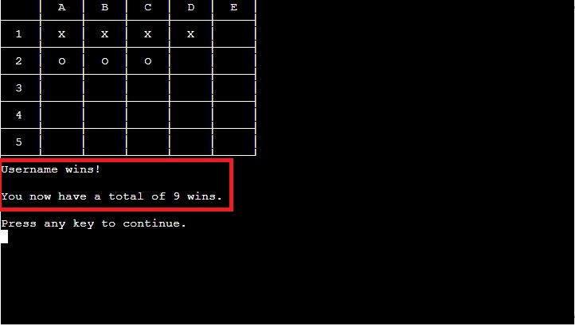
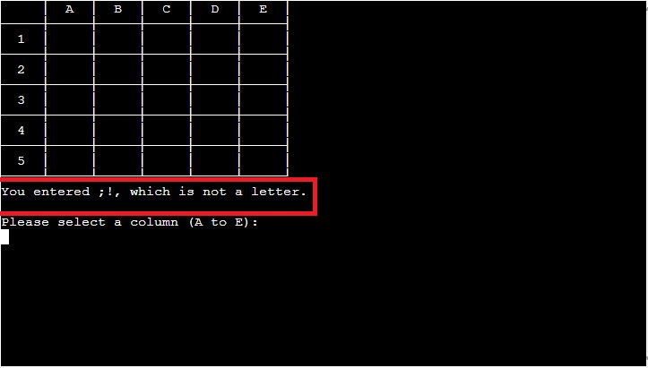

# 5x5 Tic-Tac-Toe
(Developer: Vilayat Kleer)

[View the live website](https://ci-pp3-5x5-tictactoe.herokuapp.com/)

## Table of Contents

1. [Project Goals](#project-goals)
    1. [User Goals](#user-goals)
    2. [Website Owner Goals](#website-owner-goals)
2. [User Experience](#user-experience)
    1. [Target Audience](#target-audience)
    2. [User Requirements and Expectations](#user-requirements-and-expectations)
    3. [User Stories](#user-stories)
    4. [User Manual](#user-manual)
3. [Technical Design](#technical-design)
4. [Technologies Used](#technologies-used)
    1. [Languages](#languages)
    2. [Tools](#tools)
5. [Features](#features)
6. [Testing](#validation)
8. [Bugs](#Bugs)
9. [Deployment](#deployment)
10. [Credits](#credits)
11. [Acknowledgements](#acknowledgements)

## Project Goals

### User Goals
- Play a simple and fun game for two players
- Be able to create and log in to an account that keeps my score

### Website Owner Goals
- Creating a fun game with clear instructions and simple mechanics
- Provide clear feedback to the players so they never get stuck

## User Experience

### Target Audience
- People who like Tic-Tac-Toe
- People who want to play a simple and fun game
- Casual gamers

### User Requirements and Expectations
- A simple, fun game that anyone can play
- Clear options for each menu or interaction
- Clear feedback provided when necessary
- Providing a personal touch through unique usernames

### User Manual

Click here for the user manual

#### Log in menu
When users start the program, they land on the 'Log in' menu. Above the menu, and on every other 'page' of the program except for the actual game, an ASCII logo of the game is shown. Below the logo the user is presented with three options.
Operation: Input a numeric value and press the enter key.
1. Log in
2. Create new account
3. Quit game

If the user at any point in the program or game enters a value that does not correspond to the options available, they will receive feedback of what they entered and are reminded of the available options. They will then be able to provide input again until a valid option has been chosen.

#### Log in
If option 1 is selected from the 'Log in' menu, the users will be asked to enter the email addresses they used to create an account. It will first ask player 1 to enter their email address and the player 2. It doesn't matter who logs in first as a random player will get the first turn each game.

Each email address is validated, first by checking if it follows the format of 'name@example.com' and second by looking up the email address in the database (Google Sheets file). 
If the email address doesn't follow the correct format, users will be given feedback, e.g. 'It must have exactly one @-sign'. If they enter the correct format but the email address is not registered, they will be presented with two options.
Operation: Input a numeric value and press the enter key.
1. Try different email address
2. Create new account

If option 1 is selected, the log in process is repeated. If option 2 is chosen, users will be able to create a new account.

If the log in was successful, the users will be taken to the 'Main' menu.

#### Create new account
If option 2 is selected in either the 'Log in' menu or after a failed log in, users will be able to create a new account.

The first user, player 1, will be asked to provide a username for their account, which is validated: The username has to be between 2 to 20 characters long can only contain letters and digits - no special characters are allowed. After the validation, the username will be compared to the existing usernames in the database (Google Sheets file) and if a match is found, the player will be informed and has to provide a new username.

Then, player 1 will be asked to provide an email address for their account, which is also validated: the emaill address has to follow the format of 'name@example.com'. After the validation, the email address will be compared to the existing email addresses in the database (Google Sheets file) and if a match is found, the player will be informed and has to provide a new email address.

After player 1 has created their account, the second user, player 2, will be presented with two options.
Operation: Input a numeric value and press the enter key.
1. Create new account
2. Already have an account, go to log in menu

If option 1 is selected, player 2 will go through the same process as player 1 did, except that the player will be taken to the 'Log in' menu after their account is created. If option 2 is selected, they will be taken to the log in menu.

#### Main menu
After player 1 and player 2 have logged in they land on the 'Main' menu. Here they will be presented with four options.
Operation: Input a numeric value and press the enter key.
1. Start the game
2. Read game instructions
3. View win count
4. Log out

#### Game instructions
If option 2 is selected, the game instructions will be displayed. The players will be shown the Tic-Tac-Toe grid and explained how to place a mark down on the grid. After the instructions have been displayed, they will be taken back to the 'Main' menu.
Operation: Input any key and press the enter key.

#### View win count
If option 3 is selected from the 'Main' menu, the win count of both players will be displayed. The players will then return to the 'Main' menu.
Operation: Input any key and press the enter key.

#### The game
If option 1 is selected from the 'Main' or 'Play again' menu, the players will be taken to the game. As mentioned before, a random player will be picked to have the first turn at the start of each game. 

The player will be asked to select a row number, ranging from 1 to 5. Once a row number is selected, the player will be asked to select a column letter, ranging from A to E. The selected position will then be validated to see if the position is empty or if another mark is already in place. If there is another mark in place, the player will be informed about this and prompted to select a new row number and column letter. If the position is empty, the mark will be placed and the players' turn ends. Now the other player will be able to place a mark on the grid.

if the player provides invalid input, like entering a string as the row number, the player will receive feedback of what they've entered and informed what they did wrong. They will then be able to provide input again until a valid option has been chosen. 

The game ends when one of the players has placed 4 consecutive, uninterrupted marks in a row, column or diagonal. Since the game has a 5x5 grid, there are multiple ways to achieve this. A message will be displayed to inform the players who won, displaying the winners' updated total amount of wins. The game then ends.

If neither players are able to secure a win before the grid is full, a message will be displayed to inform the players that the game is a tie. The game then ends.

After the game has ended, the players will be brought to the 'Play again' menu.
Operation: Input any key and press the enter key.

#### Play again menu
After a game has ended, no matter the outcome, players will land on the 'Play again' menu. Here they will be presented with three options.
Operation: Input a numeric value and press the enter key.
1. Play again
2. Main menu
3. Log out
4. Quit game

#### Log out
If option 4 is selected on the 'Main' menu or option 3 on the 'Play again' menu, the players will be logged out and taken to the 'Log in' menu.

#### Quit game
If option 3 is selected on the 'log in' menu or option 4 on the 'Play again' menu, a thank you message will be printed and the program will exit.

## User Stories

### User
1. As a user, I want to be able to read the game instructions
2. As a user, I want to be able to create an account
3. As a user, I want to be able to log in with my account
4. As a user, I want to be able to log out when I'm done
5. As a user, I want to be able to quit the game
6. As a user, I want to know how many games I've won
7. As a user, I want to receive feedback during and after the game
8. As a user, I want to be informed if I provide wrong input in the game

### Site owner
9. As the website owner, I want the game to be fair and have a random player get the first turn on each game
10. As the website owner, I want to provide feedback to users when they provide invalid input
11. As the website owner, I want usernames and email addresses to be saved to a Google Sheets file
12. As the website owner, I want users to be able to decide if they want to create one or two accounts during the registration process

## Technical Design

### Flowchart
A flowchart has been created to display the structure and logic of the program.

Flowchart

    

### Data Models

## Technologies Used

### Languages
- Python

### Tools
- Gitpod
- Github
- Git

### Libraries

## Built-in Python Libraries
- **os** is used to clear the terminal 
- **sys** is used to to exit the program
- **random** is used to change from player 1 to player 2 and vice versa
- [**unittest**](https://docs.python.org/3/library/unittest.html) is used to create automated tests for player_validation.py
- [**patch**](https://docs.python.org/3/library/unittest.mock.html#unittest.mock.patch) from [**unittest.mock**](https://docs.python.org/3/library/unittest.mock.html) is used to to test my register_players and log_in functions from player_validation.py, which both require multiple inputs in a row to complete the test

## Third Party Libraries
- [**gpread**](https://docs.gspread.org/en/latest/) is used to get, set and delete data in my Google Sheets file. The Google Sheets file contains the usernames, email addresses and win counts for each player that has registered.
- [**Credentials**](https://google-auth.readthedocs.io/en/master/reference/google.oauth2.credentials.html?highlight=credentials) from [**google.oauth2.service_account**](https://google-auth.readthedocs.io/en/master/) is used for the authentification that's required to connect to my Google service account to the Google Drive and Google Sheets API. A service account key has been created in JSON with the name creds.json. The connection is set up in player_validation.py. To keep the creds.json file safe, it is put in the .gitignore file to prevent it from being pushed to GitHub. As the project is deployed on Heroku, the contents of the creds.json file have been stored in a Config Var inside the Heroku application settings to make the connection work.
- [**email_validator**](https://pypi.org/project/email-validator/) is used to validate the players' email address when entered on registration and log in. It must follow the format of 'name@example.com'.

## Features
The website has a total of 8 main features:

### Game logo
- Logo created from ASCII characters 
- Is present everywhere throughout the program except during the game to make room for the 5x5 grid

Screenshot of game logo

    

### Log in menu
- Presents users with the option to log in, create an account or quit the game
- Validates the input, providing feedback if input was invalid. User will be prompted to try again if a non-existing option was selected.
- Covers user story **2**, **3**, **5** and **10**

Screenshot of log in menu

    

Screenshot of log in menu validation

    

### Log in
- Asks for a registered email address from player 1 and player 2, which must follow the format of 'name@example.com'
- Validates the email address, providing feedback if input was invalid.
    - If the input follows the correct format, compare the entered email address to the list of email addresses in the database (Google Sheets file)
        - If the email address is not registered, present the player with the option to try a different email address or create a new account
- After successfully logging in, each player is greeted by their username
- Covers user story **3** and **10**

Screenshot of log in

    
    
    

Screenshot of log in menu validation

    

### Create new account
- Allows users to create a new account for the game
- Asks for a username, which has to be unique and can only contain letters or digits
- Asks for an email address, which also has to be unique and must follow the format of 'name@example.com'
- Validates the username and email address, providing feedback if input was invalid. User will be prompted to enter a new username of email address if invalid
- After validation, the user will be asked to confirm their username and email address respectively. This is done to minimize user errors.
- Once player 1 has completed their registration, ask if player 2 wants to create a new account or go back to the log in menu
- Covers user story **2**, **10**, **11** and **12**

Screenshots of registration process

    
    
    
    
    

Screenshots of registration validation

    
    
    
    
    
    
    

### Main menu
- Presents users with the option to start the game, read the game instructions, view each players' win count or log out.
- Validates the input, providing feedback if input was invalid. User will be prompted to try again if a non-existing option was selected.
- Covers user story **1**, **4**, **6** and **10**

Screenshot of main menu

    

Screenshot of main menu validation

    

### Game instructions
- Displays the game instructions in a clear and easy to follow format
- Takes users back to the main menu after they've gone through the game instructions
- Covers user story **1**

Screenshots of game instructions

    
    
    

### View win count
- Displays each players total amount of wins
- Takes players back to the main menu after entering any key and pressing the enter key
- Covers user story **6**

Screenshot of view win count

    

### Game
- A random player is picked to have the first turn at the start of each game
- The players' name will be displayed if it's their turn
- The game grid is printed when the game starts and is updated after each turn
- Players are asked to select a row number and column letter to place a mark on the grid
- Validates the row number and column letter, providing feedback if input was invalid. User will be prompted to enter a new row number or column letter if invalid
- After a mark is placed, it will then be the other players' turn
- Provides feedback when a game is won or a tie.
    - If a game is won, the player will receive a congratulatory message with their name and their new win count
    - If the game is a tie, a message will be displayed to inform the players and take them back to the main menu
- Covers user story **7**, **8**, **9** and **10**

Screenshots of registration process

    
    
    
    
    

Screenshots of registration validation

    
    

## Testing

### Python Validation
The Python code has been validated using [Pep8 Validation Service](http://pep8online.com/) - no errors or warnings were found.

Screenshot of run.py PEP8 Validation

    

Screenshot of player_validation.py PEP8 Validation

    

Screenshot of test_player_validation.py PEP8 Validation

    

### Manual Testing - User Stories

### Automated Testing
To challenge myself, I decided to incorporate automated testing into my project. I used the built-in unittest and unittest.mock libraries to achieve this. I tested multiple seperate functions.

#### Testing the validate_player_username and validate_player_email functions
The validate_player_username and validate_player_email functions inside my player_validation.py file do exactly what their names suggest: they take a username or email address as an argument and return **True** if the format is valid. To test these I wrote a couple of simple unit tests by providing both valid and invalid input. 

If the test input is supposed to be valid, **assertTrue** is used, returning **True** in the statement - if the input was supposed to be invalid, **assertEqual** was used, returning **None** in the statement

Screenshot of validate_player_username and validate_player_email unit testing code

    

#### Testing the log_in and register_players functions
The log_in function and register_players function inside my player_validation.py file required a more advanced method to be tested, since they both require multiple user inputs. This took me a while to get right, but in the end I solved it by importing **patch** from the **unittest.mock** library. 

A patch decorator is used to access the built-in input function. The unit test is then declared, taking two parameters: self and mocked_input. The mocked_input is a **Mock** object - the side_effect function is called on this object, taking several string arguments. These arguments are iterated through when the unit test is called, providing input until the function has completed. 
Both functions use the same technique. 

Screenshot of log_in and register_players unit testing code

    

GIF of the unit tests being run

    

Since both functions don't return a value on completion, **assertEqual** is used, returning **None** in the statement.

The register_players function asks player 1 for a username, then a username confirmation, then an email address, then an email address confirmation. It will then ask player 2 if they want to create an account as well or if they want to go to the login page. In the unit test I decided to create two test accounts.

The log_in function asks for two email addresses to log in the players. After the test accounts have successfully logged in, the accounts are deleted using the delete_test_data function in my player_validation.py file.

## Bugs

| **Bug** | **Fix** |
|-------------|------------|
| Bug | Fix - [link to commit](link) |

## Deployment

### GitHub

This website was deployed using Github Pages with the following steps:

1. Go to your Github Repository
2. Navigate to the 'Settings' page
3. On the left hand menu under 'Code and automationo', click on 'Pages'
4. Under 'Source', click on the 'Branch' dropdown element and set it to your main branch (in my case, this branch is called 'main')
5. Click on 'Save'
6. Refresh the page and you will be provided with a link to your deployed Github Page.

If you want to fork this repository, follow these steps:

1. Go to the Github repository (https://github.com/vkleer/CI_PP1_TD)
2. Click on the 'Fork' button in the top right corner under the navigation bar

If you want to clone this repository, follow these steps:

1. Go to the Github repository (https://github.com/vkleer/CI_PP1_TD)
2. Click on the 'Code' button above the list of files
3. Select your preferred way of cloning, I recommend using the 'GitHub CLI' option
4. Under 'GitHub CLI', click on the copy button to copy the clone command
5. In you IDE, open Git Bash
6. Navigate to the working directory where you want to clone this directory
7. Paste in the clone command you copied and press the 'enter' key to create the clone

## Credits
Images that are not referenced below are created or owned by the developer.

## Acknowledgements
I would like to thank:
- My mentor Mo Shami for providing me with advice and guidance for this project
- My partner Lauren Baker for helping me with testing and finding multiple bugs